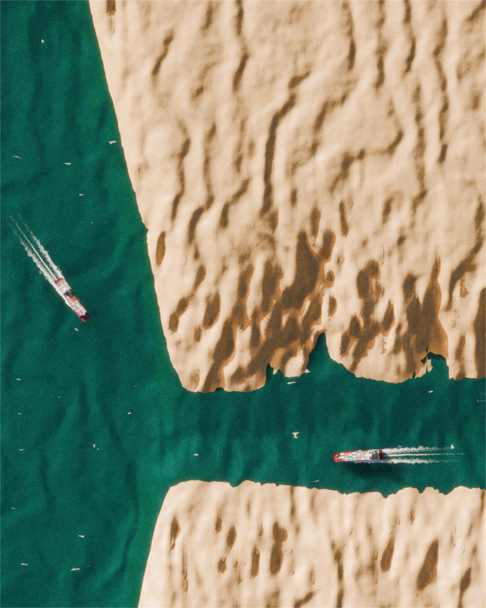
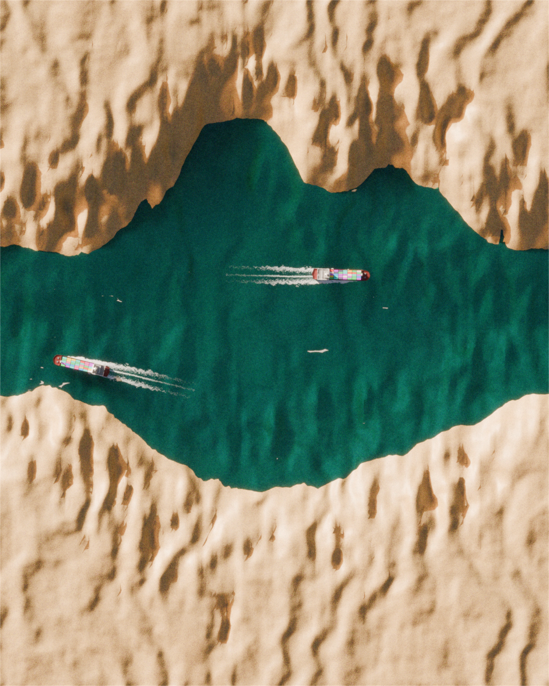
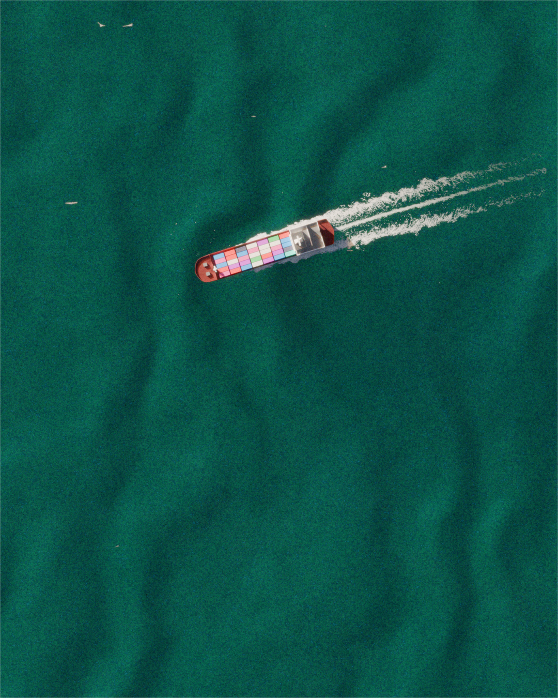

# The Strait of the Strait of Hormuz

*This is not a map.*

A 3D data-driven terrain piece: an imaginary strait whose coastline is shaped by real maritime traffic through the Strait of Hormuz, January to July 2026. Outbound vessels form the northern coast, inbound vessels the southern coast, and the channel narrows or widens exactly as recorded traffic did.

📄 [Full-resolution poster (PDF)](https://drive.google.com/file/d/18YxYB5r9AkpdW3qxX9Pq2zp--ofcToEp/view?usp=sharing) · 🎬 [Teaser video (LinkedIn)](https://www.linkedin.com/feed/update/urn:li:activity:7488234468177129472/)

## About

The data draws its own strait, one that squeezed a real trade route, oil and gas included, down to almost nothing. Vessel counts are raised above the raw AIS numbers, using Lloyd's List Intelligence findings on tankers running dark, transponders off, to dodge detection. Full methodology and limitations: [`data/SOURCES.md`](data/SOURCES.md).

| | | |
|---|---|---|
|  |  |  |

## Pipeline

1. `scripts/get_ais_data.py` — data acquisition (UKMTO, AIS)
2. `scripts/merge_data.py` — merge and clean into `data/transits.csv`
3. `scripts/visualize_svg.py` — coastline silhouette, reference geometry (SVG)
4. `scripts/heightmap.py` — signed-distance heightmap for terrain generation
5. Blender — terrain, water, ships, lighting, render (Cycles)
6. DaVinci Resolve — video edit, color, grain

## Credits

Analysis & Design: **Benjamin Bartholet** — [trab.studio](https://trab.studio) · [github.com/telohtrab](https://github.com/telohtrab)

Data: UKMTO · hormuz.data-tracking.net · WTO/AXSMarine Trade Tracker · UNCTAD · Lloyd's List Intelligence

3D model: ["Low Poly Cargo Ship"](https://sketchfab.com/3d-models/low-poly-cargo-ship-4c22cbaf01c1427f8ab60b3a07b1b32c) by [Javier_Fernandez](https://sketchfab.com/Javier.Fernandez), licensed under [CC Attribution](http://creativecommons.org/licenses/by/4.0/)
